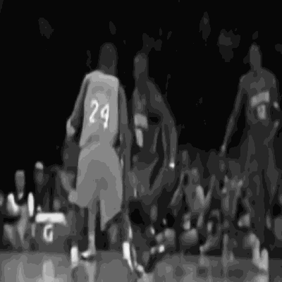
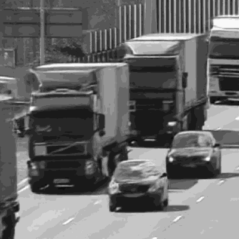
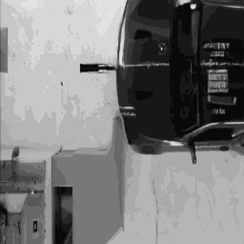
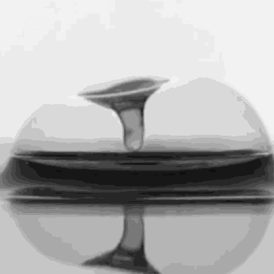
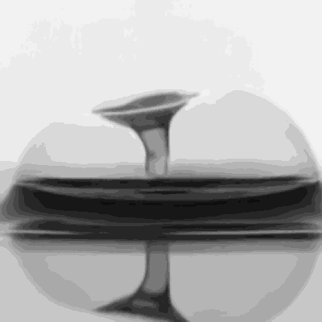

# GAP-STPNet: Dynamic Spatio-Temporal Parallel Network for Video SCI

## 📖 Introduction
Video Snapshot Compressive Imaging (SCI) faces a fundamental challenge in reconstructing high-dimensional video data from 2D compressed measurements. Traditional convolutional architectures (e.g., U-Net) provide strong spatial artifact suppression but frequently neglect temporal consistency. Conversely, video-specific priors (e.g., FastDVDnet) capture temporal dynamics effectively but exhibit limited capacity for handling severe spatial aliasing.

To address these limitations, we propose the **Spatio-Temporal Parallel Network (GAP-STPNet)**. Embedded within the Generalized Alternating Projection (GAP) optimization framework, our architecture deploys spatial and temporal priors simultaneously in parallel branches. A novel **Dynamic Fusion Cell** is introduced to adaptively compute voxel-wise attention weights, seamlessly integrating spatial details and temporal coherence at each unfolding stage.

Furthermore, to bridge the gap between ideal simulation environments and real-world optical experiments, this repository introduces a robust **3D Blind Calibration** algorithm. This method computationally corrects complex spatial translation and angular rotation mismatches of the physical mask.

## 🧠 Architecture Overview
* **Spatial Optimization Branch (U-Net)**: Functions as a robust spatial prior to suppress high-frequency aliasing and extract intra-frame representations.
* **Temporal Optimization Branch (FastDVDnet)**: Serves as a dynamic temporal prior to enforce motion continuity and inter-frame consistency across the reconstructed sequence.
* **Dynamic Hybrid Fusion**: A self-adaptive attention mechanism that dynamically calculates fusion weights to optimally combine the output manifolds of the two parallel branches.
* **3D Blind Calibration**: A coarse-to-fine physical mismatch optimization grid-search algorithm designed to calibrate sub-pixel shifts and rotational errors of the coded aperture mask.

## 📊 Quantitative Results
We evaluate GAP-STPNet on standard Video SCI benchmark datasets. The average performance across 6 scenes demonstrates state-of-the-art reconstruction fidelity.

| Scene | PSNR (dB) | SSIM |
| :--- | :---: | :---: |
| Aerial | 29.01 | 0.9109 |
| Crash | 28.16 | 0.9315 |
| Drop | 41.19 | 0.9890 |
| Kobe | 31.80 | 0.9333 |
| Runner | 37.68 | 0.9717 |
| Traffic | 27.99 | 0.9250 |
| **Average** | **32.64** | **0.9435** |

## 🎬 Qualitative Results
Visual comparison of the reconstructed frames against the ground truth across a variety of representative scenes, ranging from simple motions to complex structural details.

| Scene | Ground Truth | GAP-STPNet (Reconstruction) |
| :---: | :---: | :---: |
| **Kobe** |  |  |
| **Traffic** |  |  |
| **Crash** |  |  |
| **Drop** |  |  |

## 📁 Repository Structure
* `model.py`
  Contains the core PyTorch implementation of the `GAP_STP_Net` architecture, including the parallel branches and the dynamic fusion mechanism.
* `train.py`
  The primary optimization script for training GAP-STPNet. **Note: Pre-trained weights for the final GAP-STPNet are not provided in this repository. Researchers must execute this script to train the end-to-end model on their specific datasets.**
* `validate.py`
  The evaluation script utilized for quantitative and qualitative assessment of the reconstructed video sequences against ground-truth data.
* `test_blind_calibration.py`
  The implementation of the 3D blind calibration algorithm, assessing reconstruction robustness under simulated mask misalignment scenarios.
* `cacti/`
  A suite of essential foundational dependencies and utility functions, refined from the established CACTI framework.
* `checkpoints/`
  Stores the underlying base priors (e.g., baseline FastDVDnet and GAP-net initializations) utilized for network warmup.
* `datasets/`
  Directory designated for storing physical modulation masks and synthetic video data.

## 🙏 Acknowledgements
* This research builds upon the open-source **[CACTI](https://github.com/ucaswangls/cacti)** framework and the foundational unfolding architectures introduced in **[GAP-net](https://github.com/mengziyi64/GAP-net)**.
* The 3D Blind Calibration methodology is inspired by and builds upon the open-source implementations found in **[Physics_World_Model](https://github.com/integritynoble/Physics_World_Model)**, as detailed in **[arXiv:2603.04538](https://arxiv.org/abs/2603.04538v1)**.
